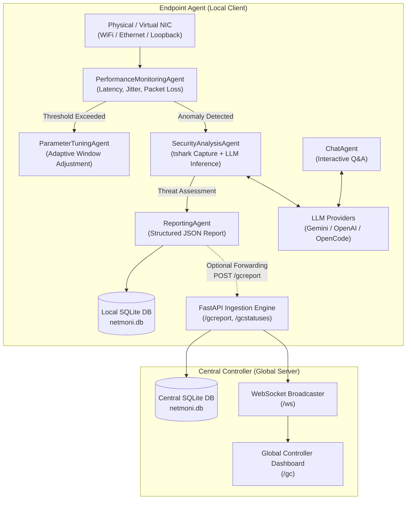

# NetMoniAI: An Agentic AI Framework for Network Security & Monitoring

[](LICENSE-MIT)
[](https://www.python.org/downloads/)
[](https://fastapi.tiangolo.com)
[](https://react.dev)
[](https://www.sqlite.org)
[](https://arxiv.org/abs/2508.10052)

**NetMoniAI** is an agentic AI framework for autonomous network monitoring and security that integrates decentralized edge analysis with lightweight centralized coordination. Built upon research published in [arXiv:2508.10052](https://arxiv.org/abs/2508.10052), NetMoniAI deploys autonomous micro-agents on each endpoint to monitor latency, packet loss, and flow statistics, while an optional Central Controller aggregates incident reports to identify coordinated attacks.

---

## 🌟 What's New in Version 2.0 (Modernized & Dynamic)

1. **Dynamic Multi-Provider AI Engine**:
   - **Google Gemini**: Powered by the modern `google-genai` SDK with full support for reasoning/thinking budget control (`gemini-3.8-flash`, `gemini-3.5-flash-lite`, etc.).
   - **OpenAI**: Native support for `gpt-4o`, `o1`, `o3-mini` with configurable reasoning effort.
   - **OpenCode & Local LLMs**: OpenAI-compatible API integration for local offline inference (Ollama, LM Studio, vLLM, DeepSeek-R1).
   - **Live Model Discovery**: Fetch available model catalogs directly through the Web UI and test connectivity with one click.
2. **Dynamic Configuration Without Server Restart**:
   - API keys, models, thinking levels, network thresholds, and capture settings can be tuned on-the-fly via the Web UI (`/settings`) or REST API.
3. **SQLite Persistence Engine (`netmoni.db`)**:
   - High-throughput Write-Ahead Logging (`PRAGMA journal_mode=WAL`) replaces in-memory state and flat JSON files.
   - Tables for `reports`, `node_statuses`, `network_metrics`, and `app_settings` with historical query APIs.
4. **Standalone Windows Installers & Portable Binaries**:
   - Zero-dependency executables for **NetMoniAI Server** and **NetMoniAI Agent** compiled with PyInstaller.
   - Includes 1-click Windows installers (`Install-Server.bat` & `Install-Agent.bat`) that create Desktop shortcuts.
   - Bundled with the production React 19 SPA dashboard so users don't need Python or Node.js installed.
5. **Architectural Decoupling (Pendekatan A - Independent Client Settings)**:
   - **Endpoint Agent**: Independent settings, local SQLite DB, automatic hardware interface discovery (WiFi/Ethernet), and optional forwarding.
   - **Central Controller**: Centralized receiver (`POST /gcreport`), SQLite aggregation, real-time WebSocket broadcasting, and global dashboard.
6. **Cross-Platform Hardware Auto-Discovery**:
   - Automatically detects active network interfaces, IP addresses, MAC addresses, and `tshark` paths across Windows, Linux, and macOS.

---

## 🔄 Perubahan dari Versi Awal (arXiv:2508.10052) & Keunggulan Versi 2.0

Versi awal dari repositori ini merupakan implementasi *proof-of-concept* (PoC) berbasis penelitian akademik. Pada **Versi 2.0**, dilakukan perombakan menyeluruh pada arsitektur, dependensi, manajemen state, integrasi AI, serta mekanisme distribusinya untuk menjadikannya **solusi pemantauan jaringan tingkat produksi (*production-ready*)**:

### 📊 Tabel Komparasi: Versi Awal vs Versi 2.0

| Fitur / Komponen | Versi Awal (PoC Paper) | Versi 2.0 (Modernized & Dynamic) | Keunggulan & Dampak |
| :--- | :--- | :--- | :--- |
| **Dukungan AI Provider** | Terbatas pada SDK lama `google-generativeai==0.8.5` (Gemini Pro) | **Multi-Provider Dynamic**: Google Gemini (`google-genai` SDK modern), OpenAI (`gpt-4o`, `o1`, `o3-mini`), dan OpenCode (Ollama, LM Studio, DeepSeek-R1) | Fleksibel memilih model cloud tercanggih atau model lokal privat (*air-gapped*) tanpa internet. |
| **Kontrol Penalaran (Thinking)** | Tidak ada; inferensi standar tanpa penyesuaian *budget* | Mendukung **Thinking Config & Budget** (`off`, `low`, `medium`, `high`, up to 32k tokens) | Analisis insiden kompleks (*multi-stage attack*) dapat memanfaatkan penalaran mendalam. |
| **Konfigurasi Sistem** | Hardcoded di source code (`SecurityAnalysisAgent.py`, `secretKeys.py`). Ganti model = edit kode | **Dynamic UI Settings**: Dapat diubah langsung dari Web UI `/settings` atau REST API tanpa restart server | Mudah dikonfigurasi oleh pengguna awam dan staf operasional tanpa perlu membuka editor kode. |
| **Penyimpanan Data** | In-memory RAM dan flat file JSON (`history.json`) yang rawan *race condition* | **Embedded SQLite Engine (`netmoni.db`)** dengan mode **WAL (Write-Ahead Logging)** | Data laporan, telemetri latency, dan status node tersimpan aman, tahan crash, dan cepat di-query. |
| **Pemisahan Peran Sistem** | Monolitik (Server dan Client menyatu, sulit dideploy terpisah di PC lain) | **Decoupled Architecture (Pendekatan A)**: Terpisah menjadi **Central Server** (port 8000) dan **Endpoint Agent** (port 8001) | Setiap laptop yang dipantau dapat berjalan mandiri dan mengirim laporan ke server pusat jika diinginkan. |
| **Deteksi Kartu Jaringan** | Menggunakan library lama `netifaces` (sering error kompilasi di Python 3.12+) | **Native Hardware Auto-Discovery** (`psutil` + standard library socket fallback) | Kompatibel *plug-and-play* dengan Python modern (3.10 hingga 3.14) dan multi-OS. |
| **Keamanan Kredensial** | File `secretKeys.py` berisiko bocor saat commit ke git | `.env.example` + SQLite settings storage + rule `.gitignore` komprehensif | Memenuhi *security best practices* (OWASP), tidak ada API key yang tersimpan di kode sumber. |
| **Distribusi & Instalasi** | Wajib install Git, Python, pip, Node.js, npm, serta build manual via terminal | **Standalone Portable Executables & Windows 1-Click Installer** (`.exe` + `.bat` installer + Desktop Shortcut) | Pengguna akhir atau tim sekuriti dapat langsung menjalankan aplikasi tanpa perlu setup environment coding. |

---

### 💡 Alasan Perubahan & Keunggulan Versi Saat Ini

1. **Fleksibilitas Tanpa Ketergantungan Vendor (No Vendor Lock-in)**
   - *Alasan*: Bergantung hanya pada satu model atau satu provider cloud berisiko tinggi saat kuota habis, koneksi internet terputus, atau kebijakan privasi melarang data jaringan dikirim ke server pihak ketiga.
   - *Keunggulan*: Versi 2.0 memungkinkan penggunaan model AI lokal (**OpenCode via Ollama/LM Studio**) sehingga analisis paket jaringan sensitif dapat dilakukan 100% di dalam jaringan lokal (*air-gapped*).

2. **Skalabilitas & Integritas Data dengan SQLite WAL**
   - *Alasan*: Menyimpan log telemetri dan laporan insiden dalam file flat JSON (`history.json`) rentan terhadap korupsi data saat beberapa agent menulis secara bersamaan (*concurrent write conflict*).
   - *Keunggulan*: SQLite dengan Write-Ahead Logging (WAL) memberikan performa penulisan tinggi tanpa mengunci proses pembacaan (*concurrent read-write*), menyediakan jejak audit permanen yang mudah di-backup dan diintegrasikan dengan SIEM/SOC.

3. **Pendekatan A: Desentralisasi Pengaturan Klien untuk Dunia Nyata**
   - *Alasan*: Dalam skenario riil di kantor atau laboratorium, setiap laptop/komputer memiliki karakteristik berbeda (spesifikasi hardware, kartu WiFi vs Ethernet, threshold jaringan yang berbeda).
   - *Keunggulan*: Klien/Agent memiliki otonomi penuh dengan konfigurasi mandiri dan database lokalnya sendiri. Jika server pusat mati atau sedang maintenance, agent di endpoint tetap bekerja memantau dan mencatat ancaman secara offline.

4. **Zero-Dependency Deployment untuk Pengguna Non-Developer**
   - *Alasan*: Meminta analis jaringan atau pengguna akhir untuk menginstal Python, menavigasi `pip install`, menyelesaikan konflik versi C-extension, dan menginstal Node.js/npm sering kali menjadi penghalang adopsi (*adoption barrier*).
   - *Keunggulan*: Tersedia installer mandiri siap pakai ([`NetMoniAI-Server.exe`](file:///c:/dev/NetMoniAI/dist/NetMoniAI-Server/NetMoniAI-Server.exe) dan [`NetMoniAI-Agent.exe`](file:///c:/dev/NetMoniAI/dist/NetMoniAI-Agent/NetMoniAI-Agent.exe)) dengan antarmuka web modern yang telah terintegrasi di dalamnya. Cukup klik ganda installer, dan aplikasi langsung berjalan.

---

## 🏗️ Architecture & Micro-Agents



### Micro-Agent Roles:
- **`PerformanceMonitoringAgent`**: Continuously pings gateway/targets, tracks latency and packet loss trends, and triggers deep analysis when thresholds are breached.
- **`SecurityAnalysisAgent`**: Triggers packet capture (`tshark`), extracts traffic features, and prompts the active LLM provider (with custom thinking depth) for semantic threat detection.
- **`ParameterTuningAgent`**: Dynamically adjusts sampling rates and sliding window sizes according to network stability.
- **`ReportingAgent`**: Formats incident reports, persists them in the local SQLite database, and optionally forwards them to the central server.
- **`ChatAgent`**: Provides a conversational security assistant for network operators to query system health.

---

## 📦 Standalone Installers (Quick Start for End Users)

You can run NetMoniAI without installing Python, Node.js, or any compiler.

Pre-packaged installers are generated in the [`dist/`](file:///c:/dev/NetMoniAI/dist/) folder:

| Component | Archive | Executable | Default Port | Default Route |
| :--- | :--- | :--- | :---: | :---: |
| **Central Controller Server** | `NetMoniAI-Server-Installer.zip` | `NetMoniAI-Server.exe` | `8000` | `http://localhost:8000/gc` |
| **Endpoint Monitoring Agent** | `NetMoniAI-Agent-Installer.zip` | `NetMoniAI-Agent.exe` | `8001` | `http://localhost:8001/` |

### A. Installing the Central Controller Server
1. Extract `NetMoniAI-Server-Installer.zip` on your monitoring server or main PC.
2. Double-click **`Install-Server.bat`**:
   - Copies files to `%LOCALAPPDATA%\NetMoniAI\Server`.
   - Creates a **NetMoniAI Server** shortcut on your Desktop.
3. Launch via the shortcut or double-click **`Start-Server.bat`**.
4. The dashboard will automatically open in your default browser at `http://localhost:8000/gc`.

### B. Installing the Endpoint Monitoring Agent
1. Extract `NetMoniAI-Agent-Installer.zip` on any endpoint/laptop you want to monitor.
2. Double-click **`Install-Agent.bat`**:
   - Copies files to `%LOCALAPPDATA%\NetMoniAI\Agent`.
   - Creates a **NetMoniAI Agent** shortcut on your Desktop.
3. Launch via the shortcut or double-click **`Start-Agent.bat`**.
4. The local dashboard will open at `http://localhost:8001/`.
5. Open the **⚙️ Settings & Database** tab (`http://localhost:8001/settings`):
   - Choose your AI provider (Gemini, OpenAI, or OpenCode).
   - Enter your API Key or local base URL.
   - Select your network card from the detected interfaces dropdown.
   - (Optional) Toggle **Central Server Forwarding** and set the Server URL (e.g. `http://192.168.1.10:8000`).

---

## 🛠️ Developer Setup (Running from Source)

### Prerequisites
- **Python**: 3.10+ (tested up to Python 3.14)
- **Node.js**: 18+ and **npm** 9+
- **Wireshark / TShark**: (Optional, for real-time packet capture)

### 1. Clone & Set Up Python Environment
```bash
git clone https://github.com/pzambare3/NetMoniAI.git
cd NetMoniAI

# Create virtual environment
python -m venv .venv

# Activate environment (Windows PowerShell)
.venv\Scripts\Activate.ps1
# On Linux/macOS: source .venv/bin/activate

# Install modern dependencies
pip install -r requirements.txt
```

### 2. Configure Environment (Optional)
Copy `.env.example` to `.env` to pre-seed default keys or ports:
```bash
cp .env.example .env
```

### 3. Launching Server & Agent (from Source Code)

#### Launch Central Controller Server:
```bash
python backend/server_entry.py
```
*Accessible in standalone desktop mode or via browser at `http://localhost:8000/gc` and Swagger API docs at `http://localhost:8000/docs`.*

#### Launch Endpoint Monitoring Agent:
```bash
python backend/agent_entry.py
```
*Accessible in standalone desktop mode or via browser at `http://localhost:8001/` and Settings at `http://localhost:8001/settings`.*

### 4. Running the Frontend Dev Server (Optional)
If modifying React source files:
```bash
cd frontend
npm install --legacy-peer-deps
npm start
```
*Frontend dev server will run on `http://localhost:3000`.*

---

## 🔨 Building Standalone Installers & Automated Testing

You can rebuild the standalone `.exe` packages and test them anytime with the included build scripts:

### Build Installers
```bash
# Builds frontend, compiles Server & Agent via PyInstaller, and creates zip installers
python build_installers.py
```
Output packages will be placed into the `dist/` directory:
- `dist/NetMoniAI-Server/` & `dist/NetMoniAI-Server-Installer.zip`
- `dist/NetMoniAI-Agent/` & `dist/NetMoniAI-Agent-Installer.zip`

### Automated End-to-End Test Suite
```bash
python test_compiled_binaries.py
```
This automated suite launches both compiled binaries simultaneously, validates settings JSON, tests React SPA rendering, verifies interface discovery, sends a simulated attack report from Agent to Server, and verifies SQLite persistence.

---

## 🔌 REST & WebSocket API Reference

The FastAPI backend includes interactive Swagger documentation available at:
- **Server Docs**: `http://localhost:8000/docs`
- **Agent Docs**: `http://localhost:8001/docs`

| Endpoint | Method | Mode | Description |
| :--- | :---: | :---: | :--- |
| `/api/settings` | `GET` | Both | Retrieve active configuration (AI, thresholds, capture, forwarding) |
| `/api/settings` | `PUT` | Both | Dynamically update configuration without restarting the application |
| `/api/system/interfaces` | `GET` | Agent | Enumerate physical/virtual network cards, IP, MAC, and statuses |
| `/api/ai/models` | `POST` | Both | Fetch live model catalog from Gemini, OpenAI, or OpenCode |
| `/api/ai/test` | `POST` | Both | Test connectivity and latency to chosen AI provider |
| `/api/central-server/ping` | `POST` | Agent | Test connectivity from Agent to Central Controller |
| `/api/reports` | `GET` | Both | Query historical incident reports from local SQLite database |
| `/api/metrics` | `GET` | Both | Query time-series network telemetry from SQLite |
| `/gcreport` | `POST` | Server | Ingestion endpoint for receiving node reports |
| `/gcstatuses` | `GET` | Server | Retrieve all active node statuses from central SQLite |
| `/ws` | `WebSocket` | Both | Real-time WebSocket connection for live telemetry and chat |

---

## ⚙️ Configuration Reference

Settings can be managed dynamically through the Web UI (`/settings`) or via environment variables:

```bash
# --- Application Mode ---
APP_MODE=all               # Options: 'server', 'agent', 'all'
APP_PORT=8000              # Port to bind (8000 for server, 8001 for agent)

# --- AI Provider Defaults ---
AI_ACTIVE_PROVIDER=gemini  # Options: 'gemini', 'openai', 'opencode'

# Google Gemini
GEMINI_API_KEY=AIzaSy...
GEMINI_DEFAULT_MODEL=gemini-3.8-flash
GEMINI_THINKING_LEVEL=medium  # Options: 'off', 'low', 'medium', 'high'
GEMINI_THINKING_BUDGET=2048

# OpenAI
OPENAI_API_KEY=sk-proj-...
OPENAI_DEFAULT_MODEL=gpt-4o
OPENAI_REASONING_EFFORT=medium # Options: 'low', 'medium', 'high'

# OpenCode / Local LLM
OPENCODE_API_KEY=opencode-token
OPENCODE_BASE_URL=http://localhost:11434/v1
OPENCODE_DEFAULT_MODEL=opencode-deepseek-r1

# --- Network Thresholds ---
LATENCY_THRESHOLD=75.0        # Average latency trigger (ms)
PACKET_LOSS_THRESHOLD=5.0     # Average packet loss trigger (%)
CAPTURE_DURATION=18           # tshark capture cycle (seconds)

# --- Central Server Forwarding (Agent Mode) ---
CENTRAL_SERVER_ENABLED=true
CENTRAL_SERVER_URL=http://localhost:8000
# --- Windows Integration (Startup & Tray) ---
START_ON_BOOT=true             # Automatically register in Windows Registry Run key
MINIMIZE_TO_TRAY=true          # Hide to Windows System Tray near clock when minimized
CLOSE_TO_TRAY=true             # Keep telemetry active when window close button (X) is clicked
```

---

## 🖥️ Windows System Tray & Auto-Startup Integration

NetMoniAI is built with native Windows background services:

1. **System Tray Integration**:
   - When minimized or closed, NetMoniAI hides from the taskbar and stays active in the Windows notification area (System Tray).
   - Right-click tray menu provides quick access to:
     - `Open Dashboard` (or double-click tray icon)
     - `Minimize to Tray`
     - `Start with Windows` (live registry toggle)
     - `Exit NetMoniAI`
   - Background telemetry, ping latency tracking, and packet sniffing continue uninterrupted.
2. **Silent Windows Boot Startup (`--tray`)**:
   - Can be toggled on/off with 1 click in the **Settings Dashboard** or tray menu.
   - Registers directly in `HKEY_CURRENT_USER\Software\Microsoft\Windows\CurrentVersion\Run`.
   - On Windows boot, launches silently in background with `--tray` without displaying any pop-ups.

---

## 🗄️ Database Architecture (`netmoni.db`)

All persistent state is stored in an embedded SQLite database configured with **WAL (Write-Ahead Logging)** mode for high concurrency:

1. **`reports`**: Stores full audit trails of incident reports, timestamps, node IPs, attack types, severity, metrics snapshot, and LLM explanation.
2. **`node_statuses`**: Tracks the latest known state of monitored endpoints (status: `normal`, `warning`, `under_attack`, last seen timestamp).
3. **`network_metrics`**: Stores continuous time-series telemetry (latency, packet loss, target host, timestamp).
4. **`app_settings`**: Persists system settings across restarts.

---

## 🧪 Scientific Background & Evaluation

NetMoniAI was evaluated in research experiments across two environments:

1. **Local Micro-Testbed**:
   - Ubuntu testbed with kernel-level traffic conditioning (`tc` utility, NetEM) simulating up to 600ms latency and bandwidth restrictions.
   - Micro-agents detected anomalies in **< 5 seconds** and successfully triggered LLM reasoning.
2. **NS-3 Discrete-Event Simulation**:
   - Multi-node topology simulating coordinated TCP SYN floods and DDoS traffic.
   - Central Controller aggregated node reports and accurately separated **attackers**, **victims**, and **benign** nodes.

---

## 📚 Citation

If you use NetMoniAI in your academic work or research, please cite the original paper:

```bibtex
@article{zambare2025netmoniai,
  title={NetMoniAI: An Agentic AI Framework for Network Security \& Monitoring},
  author={Zambare, Pallavi and Thanikella, Venkata Nikhil and 
          Kottur, Nikhil Padmanabh and Akula, Sree Akhil and Liu, Ying},
  journal={arXiv preprint arXiv:2508.10052},
  year={2025}
}
```

---

## 📄 License

This project is dual-licensed under:
- **MIT License** - see [LICENSE-MIT](LICENSE-MIT)
- **Apache License 2.0** - see [LICENSE-APACHE](LICENSE-APACHE)

**SPDX-License-Identifier**: MIT OR Apache-2.0

---

## 👥 Authors & Acknowledgments

### 🚀 Version 2.0 Lead Developer & Architecture Modernization:
- **Fajar Sebastian** - sebastian.fajr@gmail.com 
  *System engineering, Dynamic Multi-Provider LLM Engine (Gemini/OpenAI/OpenCode), SQLite WAL Persistence, Decoupled Server/Agent Architecture, Dynamic Hardware Auto-Discovery, and Standalone Windows Packaging.*

### 📄 Original Research & PoC Authors (arXiv:2508.10052):
- **Pallavi Zambare** - Texas Tech University - pzambare@ttu.edu
- **Venkata Nikhil Thanikella** - nikhilvenkata.t@gmail.com
- **Nikhil Padmanabh Kottur** - nkotturi@ttu.edu
- **Sree Akhil Akula** - sreakula@ttu.edu
- **Dr. Ying Liu** - y.liu@ttu.edu
